# Holodeck Studio

> As a Star Trek fan disappointed by the newest productions, I created a multi-agent system for video series production. If you're not a Star Trek fan, no worries — this works on any subject :-)

Created via [opencode](https://opencode.ai) × [Spec Kit](https://github.com/tikal/spec-kit) — spec-driven AI software engineering.  
Codebase built iteratively from specs (`specs/` → plans → research → tasks → impl), all within opencode CLI.  
[RTK (Rust Token Killer)](https://github.com/khunkin/rtk) for lean context management. [Caveman](https://opencode.ai) mode for ultra-terse agent communication.

## Agentic Workflow

```mermaid
graph TD
    subgraph Creative["Creative Development"]
        SR[Showrunner] -->|theme prompt| HW[Head Writer]
        HW -->|outline| SW[Staff Writer]
        SW -->|script| CH[Canon Historian]
        CH -->|canon report| CR[Critic]
        CR -->|critique| PR[Producer]
    end
    
    subgraph Design["Visual Design"]
        PR -->|budget| PD[Production Designer]
        PD -->|style guide| DR[Director]
        DR -->|visual direction| CD[Character Designer]
        CD -->|characters| ED[Environment Designer]
        ED -->|environments| SB[Storyboard]
    end
    
    subgraph Audio["Audio Production"]
        SB -->|storyboard| CO[Composer]
        CO -->|musical score| SD[Sound Designer]
        SD -->|sound design| VD[Voice Director]
        VD -->|voice direction| VS[Voice Synthesis]
        VS -->|dialogue audio| SFX[SFX Mixer]
    end
    
    subgraph Render["Media Assembly"]
        SFX -->|mixed audio| AG[Asset Generation]
        AG -->|assets| AN[Animation]
        AN -->|animation| FR[Frame Renderer]
        FR -->|frames| VA[Video Assembler]
        VA -->|final video| QA[QA Agent]
        QA -->|qa report| AU[Audience Simulation]
    end
    
    AU -->|release| OUT[🎬 Final Output]
```



**Stage Flow:**

| Phase | Stage | Agent | Output |
|-------|-------|-------|--------|
| 1 | concept | Showrunner | Theme breakdown, creative direction |
| 2 | outline | Head Writer | Story outline, scene structure |
| 3 | script | Staff Writer | Full script with dialogue |
| 4 | review | Canon Historian | Canon compliance report |
| 5 | review | Critic | Quality critique + score |
| 6 | review | Producer | Budget report, greenlight |
| 7 | asset_generation | Production Designer | Visual style guide |
| 8 | storyboard | Director | Shot compositions, camera moves |
| 9 | asset_generation | Character Designer | Character visual descriptions |
| 10 | asset_generation | Environment Designer | Location/background designs |
| 11 | storyboard | Storyboard | Frame-by-frame visual plan |
| 12 | audio | Composer | Musical score suggestions |
| 13 | audio | Sound Designer | Ambience + SFX cues per scene |
| 14 | audio | Voice Director | Per-character voice direction |
| 15 | audio | Voice Synthesis | Dialogue audio files (MP3) |
| 16 | audio | SFX Mixer | Mixed audio (dialogue + ambience + SFX) |
| 17 | asset_generation | Asset Generation | Prop + effect descriptions |
| 18 | animation | Animation | Scene motion + timing |
| 19 | render | Frame Renderer | SVG/AI-composited frames |
| 20 | render | Video Assembler | Final video (MP4) |
| 21 | review | QA Agent | Quality check report |
| 22 | review | Audience Simulation | Audience reaction simulation |

## Typical Output

```bash
$ uv run holodeck produce "A stranded crew discovers an ancient relay network that can fold space, \
but using it attracts a predator species" --bible 9044edee --preview

Starting production: A stranded crew discovers an ancient relay network...
  Mode: autonomous
  Output: ./output

Production 4a7b2c1d complete!
  Output folder: /home/user/projects/holodeckStudio/output

=== SCRIPT ===
INT. VOYAGER BRIDGE - DAY

CAPTAIN KESSLER stands at the tactical station, studying an ancient alien console...

=== CANON HISTORIAN REPORT ===
Canon compliance: 94% - Alien relay technology consistent with established lore...

=== CRITIC REVIEW ===
Score: 87/100 - Strong character development, pacing improves in act 2...

=== SOUND DESIGN ===
SCENE 1: Bridge
- AMBIENCE: Quiet hum of starship engines, bridge background
- FOLEY: Footsteps on metal deck
- SFX: Console activation beep, alert klaxon

SCENE 2: Alien Relay Chamber  
- AMBIENCE: Eerie subspace resonance, alien machinery hum
- SFX: Relay activation surge, predator arrival warning

=== DIALOGUE AUDIO ===
  [CAPTAIN KESSLER] "We've found something incredible..."
    → output/media/4a7b2c1d/dialogue_0000_CAPTAIN.mp3
  [ENGINEER TORRES] "The energy signature... it's like nothing I've seen."
    → output/media/4a7b2c1d/dialogue_0001_ENGINEER.mp3

=== VIDEO ===
  output/media/4a7b2c1d/episode_5e8f.mp4
  15 frames generated (preview mode)
  Smooth zoom: enabled
  Color grade: noir
  Enhancement: svg
```

## Kubernetes Deployment (Colima)

## Prerequisites

- Python 3.11+
- [Colima](https://github.com/abiosoft/colima) with Kubernetes enabled
- `kubectl` CLI
- `uv` for Python package management
- **Media generation** (stage 20–22): `ffmpeg`, `convert` (ImageMagick) binaries
  ```bash
  # Ubuntu/Debian
  sudo apt install ffmpeg imagemagick
  # macOS
  brew install ffmpeg imagemagick
  ```

## Quick Start (Make)

```bash
# Full cluster up — colima → k8s → infra → port-forwards → migrations
make start

# Stop services (keep cluster running)
make stop

# Full teardown including volumes (destroys data)
make delete

# Cluster status + k8s pods
make status
```

## Manual Steps

## 5. Install Dependencies

```bash
python -m venv .venv
source .venv/bin/activate
uv pip install -e ".[dev]"
```

## 6. Configure Environment

```bash
cp .env.example .env
# Add your model provider API keys:
# OPENAI_API_KEY=sk-...
# ANTHROPIC_API_KEY=sk-...
# Langfuse keys (if using):
# LANGFUSE_PUBLIC_KEY=pk-...
# LANGFUSE_SECRET_KEY=sk-...
```

## 7. Run Database Migrations

```bash
alembic upgrade head
```

## 8. User Guide — Bible & Produce

### Franchise Bibles

```bash
# Create a bible
holodeck bible create "Star Trek: Voyager" "A Star Trek fan series set in the 25th century"

# List bibles
holodeck bible list

# Show bible details + entries
holodeck bible show <bible-id>

# Add lore entries (categories: character, location, technology, lore, event)
holodeck bible add-entry <bible-id> \
  --category technology \
  --name "Alien Relay Network" \
  --content "Ancient network of subspace relay stations that fold spacetime. \
Activating a relay emits a energy signature that attracts predatory species."

holodeck bible add-entry <bible-id> \
  --category character \
  --name "Captain Mira Kessler" \
  --content "Human, late 30s, pragmatic but compassionate. Former Starfleet tactical officer."

holodeck bible add-entry <bible-id> \
  --category lore \
  --name "The Fold Predators" \
  --content "Unknown species that hunts by sensing fold-space energy. \
They can track ships across sectors once a relay is activated."

# Search bible entries
holodeck bible search <bible-id> "relay"
```

Bibles are stored in memory (process lifetime). Use `--bible <id>` with `produce` to inject entries as context for canon verification.

### Producing an Episode

```bash
# Dry-run: validate prompt without LLM calls
holodeck produce "A stranded crew discovers an ancient alien relay network" --dry-run

# Full production: runs all 22 agents with LLM calls
holodeck produce "A stranded crew discovers an ancient relay network that can fold space, \
but using it attracts a predator species" --bible <bible-id>

# Preview mode: fast 640x360, 12fps, 15-frame cap (for rapid iteration)
holodeck produce "A stranded crew..." --preview --bible <bible-id>

# Silent video: skip voice synthesis (for debugging visuals)
holodeck produce "A stranded crew..." --no-voice --preview

# Dialogue-only audio: skip SFX mixing
holodeck produce "A stranded crew..." --no-sfx

# With a specific production mode
holodeck produce "A stranded crew..." --mode supervised --bible <bible-id>

# Skip approval checkpoints (autonomous mode)
holodeck produce "A stranded crew..." --no-approve
```

The pipeline runs **22 agents** across 5 phases: **Creative** → **Design** → **Audio** → **Render** → **Review**. Each agent calls the configured LLM model, reviews its own output, and results are tracked in memory.

### Production Status

```bash
# Basic status
holodeck status <production-id>

# With agent execution table (scores, approvals)
holodeck status <production-id> --verbose

# Raw JSON output
holodeck status <production-id> --json
```

### Configuration

```bash
# View all settings
holodeck config show

# Override a setting (persisted to ~/.holodeck/config.json)
holodeck config set holodeck_default_model "openai/gpt-5.4-mini"

# Reset to defaults
holodeck config reset
```

Override precedence: CLI flags > `~/.holodeck/config.json` > `.env` > defaults.

## Running Tests

```bash
# All tests
pytest

# Unit tests only (no cluster required)
pytest tests/unit/

# Integration tests (requires cluster + port-forwards)
pytest tests/integration/

# With coverage
pytest --cov=holodeck --cov-report=html
```

## Infrastructure Access

| Service | Cluster Service | Port-Forward | Local URL |
|---------|----------------|--------------|-----------|
| PostgreSQL | `postgres:5432` | `5432` | `localhost:5432` |
| MinIO API | `minio:9000` | `9000` | `localhost:9000` |
| MinIO Console | `minio:9001` | `9001` | http://localhost:9001 |
| Langfuse | `langfuse:3000` | `3000` | http://localhost:3000 |

MinIO Console login: `minioadmin` / `minioadmin`

## Useful Commands

```bash
# Quick teardown (volumes preserved)
make stop

# Full reset (volumes deleted — data lost)
make delete

# View all Holodeck resources
kubectl get all -l app=holodeck

# View pod logs
kubectl logs -l app=holodeck,component=postgres --tail=50
kubectl logs -l app=holodeck,component=minio --tail=50

# Connect to PostgreSQL
kubectl exec -it deployment/postgres -- psql -U holodeck -d holodeck

# Stop Colima only
colima stop
```

## Project Structure

```text
k8s/
├── config.yaml          # Secrets + ConfigMap
├── postgres.yaml        # PostgreSQL + pgvector Deployment/Service/PVC
├── minio.yaml           # MinIO Deployment/Service/PVC
├── langfuse.yaml        # Langfuse Deployment/Service (optional)
└── init-jobs.yaml       # Database + bucket initialization Jobs
src/holodeck/
├── cli/                 # CLI entry points (Typer)
├── agents/              # Agent implementations by department
├── pipeline/            # Stage orchestration, events, orchestrator
├── memory/              # Franchise Bible, Episode, Production memory
├── storage/             # PostgreSQL and object storage adapters
├── observability/       # Langfuse tracing, evaluation
└── config/              # Pydantic settings
```

## Project Scope

**Implemented (128 tasks):**
- Full 22-agent pipeline from concept to final video
- Franchise bible management (character/location/tech/lore entries)
- Voice synthesis with Piper TTS (multi-voice, gender-aware casting) + gTTS fallback
- SFX mixing with 130+ TrekCore sound effects (ambience + Foley + one-shot SFX)
- Video assembly with FFmpeg (smooth zoom, color grading, camera moves, subtitles)
- Preview mode for rapid iteration (640×360, 12fps, 15-frame cap)
- AI image generation via Replicate (Flux-2-Pro) with SVG fallback
- Kubernetes deployment (Colima + PostgreSQL + MinIO + Langfuse)
- 327 unit tests, full observability tracing

**Future phases:**
- Background music integration (needs free source)
- Voice cloning with ElevenLabs (requires user audio samples)
- Real-time lip-sync from audio waveform
- Multi-episode series continuity